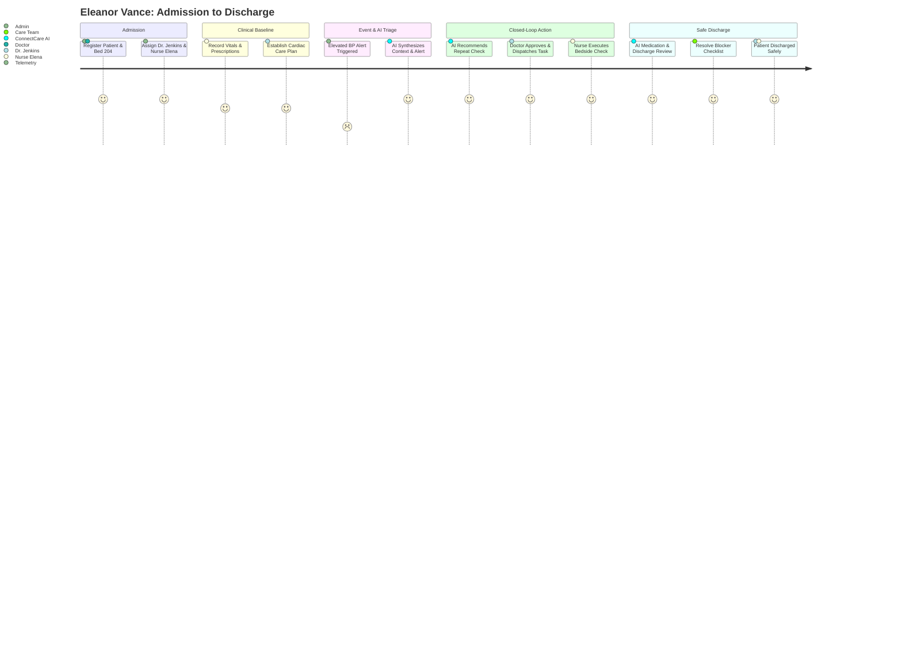

# ConnectCare — Complete Video Demo Recording Master Script

This master script contains click-by-click recording instructions, voiceover narration scripts, and pre-configured test data for the 3-part ConnectCare video showcase.

---

## 🛠️ Pre-Recording Setup & Configuration

### 1. Launch Services
Open two terminal windows in the workspace root:

```bash
# Terminal 1: Backend API (.NET 10 & PostgreSQL)
dotnet run --project backend/src/ConnectedCare.Api/ConnectedCare.Api.csproj --launch-profile http

# Terminal 2: React Frontend (Vite)
cd frontend
npm run dev
```

* **Frontend URL:** `http://localhost:5173`
* **Swagger API:** `http://localhost:5231/swagger`

### 2. Demo Credentials
* **Administrator:** `username: admin` | `password: admin123`
* **Doctor:** `username: doctor` | `password: doctor123`
* **Nurse:** `username: nurse` | `password: nurse123`

### 3. Screen & Recording Settings
* **Resolution:** 1920 × 1080 (16:9 Full HD)
* **Browser:** Chrome or Edge in Full Screen (`F11`), Zoom at 90% or 100%
* **Cursor:** Smooth mouse movements, 1-second pause on button clicks

---

## 🎬 Video 1: ConnectCare Core Healthcare Platform (15–20 min)
*Theme: Role-based clinical operations, multi-disciplinary care coordination, and healthcare data integrity.*

### Flow 01: Secure Login & Role-Based Access
* **Screen:** `/login`
* **Actions:**
  1. Show clean login screen with PostgreSQL authentication badge.
  2. Log in as **Admin** (`admin` / `admin123`) $\rightarrow$ Show full administrative navigation (15 items).
  3. Log out $\rightarrow$ Log in as **Doctor** (`doctor` / `doctor123`) $\rightarrow$ Show Doctor-focused navigation (My Patients, Consultations, Care Plans, AI Assistant).
  4. Log out $\rightarrow$ Log in as **Nurse** (`nurse` / `nurse123`) $\rightarrow$ Show Nurse bedside tools (Vital Rounds, Shift Handover, Task Manager).
* **Voiceover:** *"ConnectCare enforces strict healthcare role-based access control. Each clinical role receives a purpose-built workspace designed specifically for their workflow."*

### Flow 02: Hospital & Organization Setup
* **Screen:** Logged in as Admin $\rightarrow$ `/settings` & `/locations`
* **Actions:**
  1. Open **Settings** $\rightarrow$ General Settings: Hospital Name (*Connected Care Senior Living*), Timezone, Units.
  2. Open **Locations / Units** $\rightarrow$ Show Wings, Floors (Floor 1, Floor 2, Memory Care, ICU), bed capacities, and current occupancy.
  3. Open **Settings $\rightarrow$ Roles & Permissions** $\rightarrow$ Show permission matrix with over 40 granular permissions.
* **Voiceover:** *"Administrators can configure the complete organizational hierarchy: from facility locations and care units to granular permission controls."*

### Flow 03: Doctor Management & Dependency Safety
* **Screen:** `Admin` $\rightarrow$ `/doctors`
* **Actions:**
  1. Browse Doctor roster $\rightarrow$ Filter by specialty (*Cardiology*, *Internal Medicine*).
  2. Click **Add Doctor** $\rightarrow$ Name: `Dr. Sarah Jenkins`, Specialty: `Cardiology`, Department: `Internal Medicine`, License: `TX-MD-88421` $\rightarrow$ Save.
  3. Open Dr. Jenkins's profile $\rightarrow$ Show assigned care units.
  4. **Highlight:** Attempt to delete a doctor with active patient dependencies $\rightarrow$ System displays safety prevention dialog.
* **Voiceover:** *"ConnectCare protects clinical continuity with dependency protection, ensuring providers with active patient responsibilities cannot be accidentally deleted."*

### Flow 04: Nurse & Care Team Management
* **Screen:** `Admin` $\rightarrow$ `/nurses` & `/care-teams`
* **Actions:**
  1. Add nurse `Elena Rostova, RN` $\rightarrow$ Assign to Floor 2 / Unit B.
  2. Open **Care Teams** $\rightarrow$ Show multidisciplinary team linking attending physician Dr. Jenkins and primary nurse Elena to Floor 2.
* **Voiceover:** *"Care teams connect physicians, nurses, and allied health professionals directly to specific patient cohorts and physical care units."*

### Flow 05: Patient Registration & Care-Team Assignment
* **Screen:** `/patients` $\rightarrow$ `/patients/new`
* **Actions:**
  1. Click **Add Patient** $\rightarrow$ Register demo patient:
     * **Name:** `Eleanor Vance`
     * **DOB / Age:** `04/12/1946 (78 yrs)` | **Gender:** `Female`
     * **Room / Bed:** `Floor 2, Room 204`
     * **Primary Doctor:** `Dr. Sarah Jenkins` | **Primary Nurse:** `Elena Rostova, RN`
     * **Admission Diagnosis:** `Post-operative Cardiac Rehab & Congestive Heart Failure`
  2. Click **Save** $\rightarrow$ System navigates to Eleanor Vance's **Patient Profile**.
* **Voiceover:** *"Patient admission captures complete demographic, insurance, and medical records while establishing the assigned care team."*

### Flow 06: Patient Clinical Record & Vitals
* **Screen:** `/patients/:id` $\rightarrow$ Vitals Tab
* **Actions:**
  1. Review patient overview banner, assigned providers, and current status.
  2. Click **Record Vitals**:
     * **Blood Pressure:** `138/88 mmHg` | **Heart Rate:** `82 bpm`
     * **Temperature:** `99.1 °F` | **SpO2:** `96%` | **Resp Rate:** `18 bpm`
  3. Save $\rightarrow$ View live physiological charts and historical trend lines.
* **Voiceover:** *"Vitals tracking provides immediate trend analysis, giving clinicians instant visibility into vital sign progression over time."*

### Flow 07: Medication Management
* **Screen:** `/patients/:id` $\rightarrow$ Medications Tab
* **Actions:**
  1. Click **Add Medication**:
     * **Drug:** `Lisinopril 10mg Oral Daily`
     * **Frequency:** `Once Daily with Morning Meal`
  2. Save $\rightarrow$ Add second medication: `Metoprolol Tartrate 25mg BID`.
  3. Show active prescription list, dosage schedules, and discontinuation audit trail.
* **Voiceover:** *"The e-prescribing module tracks active regimens, dosage schedules, and maintains full audit history for all medication changes."*

### Flow 08: Alerts & Clinical Monitoring
* **Screen:** `/alerts`
* **Actions:**
  1. Open Alert Dashboard $\rightarrow$ Filter by *Critical* and *High* priority.
  2. Select an active alert for Eleanor Vance (*Elevated Blood Pressure Warning*).
  3. Click **Acknowledge** $\rightarrow$ Add clinical note $\rightarrow$ Escalate to attending physician.
* **Voiceover:** *"Automated alert thresholds notify the care team the moment vital telemetry crosses clinical safety parameters."*

### Flow 09: Care Plan Management
* **Screen:** `/care-plans` or `/patients/:id` $\rightarrow$ Care Plans
* **Actions:**
  1. View active care goals $\rightarrow$ Click **Add Care Plan Goal**.
  2. Goal: `Cardiac Rehabilitation & Daily Ambulation` | Intervention: `Assisted 15-minute hallway walk twice daily` | Owner: `Elena Rostova, RN`.
  3. Update milestone progress to 40%.
* **Voiceover:** *"Structured care plans align doctors, nurses, and therapists around measurable recovery milestones."*

### Flow 10: Care Team Task Management
* **Screen:** `/tasks`
* **Actions:**
  1. Click **Create Task** $\rightarrow$ Patient: `Eleanor Vance` | Task: `Check Blood Glucose & Potassium levels before dinner` | Priority: `High` | Assignee: `Elena Rostova`.
  2. Open task $\rightarrow$ Update status: *Pending* $\rightarrow$ *In Progress* $\rightarrow$ *Completed*.
* **Voiceover:** *"The task dashboard closes the operational loop, ensuring every clinical order is tracked to verified completion."*

---

## 🤖 Video 2: ConnectCare Clinical AI Suite (15–20 min)
*Theme: Grounded clinical intelligence, human-in-the-loop validation, and enterprise AI safety.*

### Flow 11: AI Patient Summary
* **Screen:** `/patients/:id` $\rightarrow$ Care Intelligence Tab
* **Actions:**
  1. Click **Generate AI Summary** $\rightarrow$ Show loading spinner with model telemetry.
  2. Review structured summary:
     * *Clinical Overview & Trajectory*
     * *Active Risk Factors (Cardiac & Renal)*
     * *Key Clinical Findings & Watchlist*
* **Voiceover:** *"ConnectCare AI synthesizes hours of EHR telemetry, notes, and medication changes into a concise, clinically structured brief."*

### Flow 12: AI Care Team Intelligence $\rightarrow$ Task Creation (⭐ Flagship AI Flow)
* **Screen:** `/patients/:id` $\rightarrow$ Care Intelligence
* **Actions:**
  1. Click **Generate AI Care Priorities**.
  2. AI identifies: `Evening blood pressure check & hydration monitoring due to new diuretic`.
  3. Click **Accept Recommendation $\rightarrow$ Create Task**.
  4. System pre-populates the task form $\rightarrow$ Assign to `Elena Rostova, RN` $\rightarrow$ Save.
  5. Open `/tasks` to show the resulting task linked to the AI decision.
* **Voiceover:** *"ConnectCare bridges the gap between AI insights and frontline execution. With one click, an AI recommendation becomes an assigned nursing task."*

### Flow 13: AI Alert Prioritization & Escalation
* **Screen:** `/alerts` $\rightarrow$ Select Alert $\rightarrow$ AI Prioritization
* **Actions:**
  1. Select telemetry alert $\rightarrow$ Run **AI Triage**.
  2. AI correlates the alert with the patient's cardiac history and flags high acute escalation risk.
  3. Clinician clicks **Escalate to Attending Physician**.
* **Voiceover:** *"AI alert prioritization reduces alarm fatigue by analyzing multi-factor patient context to highlight truly critical events."*

### Flow 14: AI Medication Safety Review
* **Screen:** `/patients/:id` $\rightarrow$ Medications $\rightarrow$ AI Safety Review
* **Actions:**
  1. Click **Run AI Medication Review**.
  2. AI checks drug-drug interactions, duplicate therapies, and Beers Criteria for geriatric safety.
  3. Show findings: `Caution: Concurrent ACE inhibitor and Potassium-sparing agent`.
  4. Clinician reviews recommendation $\rightarrow$ Clicks **Review with Pharmacist**.
* **Voiceover:** *"AI medication safety reviews act as a second pair of eyes, flagging contraindications while keeping the prescribing clinician fully in control."*

### Flow 15: AI Discharge Readiness
* **Screen:** `/patients/:id` $\rightarrow$ Discharge Tab
* **Actions:**
  1. Click **Generate AI Discharge Review**.
  2. AI evaluates readiness score and identifies 2 discharge blockers:
     * *Pending Cardiology Follow-up Appointment*
     * *PT Mobility Sign-off*
  3. Click **Create Blocker Tasks** $\rightarrow$ Automatically assign to care coordinator.
* **Voiceover:** *"AI Discharge Readiness proactively identifies logistical and clinical blockers days before discharge, preventing readmissions."*

### Flow 16 & 17: Doctor & Nurse AI Copilots
* **Screen:** `/ai-copilot`
* **Actions:**
  * **Doctor Copilot:** Ask: *"Summarize Eleanor Vance's vitals trajectory over the last 48 hours."* $\rightarrow$ AI provides referenced timeline.
  * **Nurse Copilot:** Ask: *"Generate a shift handoff checklist for Room 204."* $\rightarrow$ AI generates prioritized nursing handoff points.
* **Voiceover:** *"Role-aware AI Copilots understand whether they are assisting an attending physician reviewing diagnostics or a staff nurse preparing for shift handover."*

### Flow 18, 19 & 20: Human Review, AI Context & Transparency
* **Screen:** On any AI result card $\rightarrow$ Click **View AI Context**
* **Actions:**
  1. Open AI Evidence Drawer $\rightarrow$ Show exact timestamped EHR JSON payload passed to the model.
  2. Show Human-in-the-Loop buttons: **Accept**, **Edit**, **Dismiss**, **Flag Issue**.
* **Voiceover:** *"ConnectCare guarantees full explainability. Clinicians can inspect the exact EHR context used for every inference."*

### Flow 21–24: AI Operations, Audit Trail & Governance
* **Screen:** `/ai-operations`
* **Actions:**
  1. Show **AI Operations Dashboard**: Request counts, 99.8% uptime, P95 latency (1.2s), token usage.
  2. Show **Audit Trail**: Every AI query, prompt snapshot, clinician action, and response ID.
  3. Show **AI Settings & Guardrails**: Safety filters, model selection (GPT-4o, Claude 3.5), and rate limits.
  4. Show **AI Quality & Evaluation**: Benchmark regression tests, hallucination metrics, and schema compliance.
* **Voiceover:** *"Enterprise-grade healthcare AI requires enterprise governance: comprehensive audit logging, latency tracking, and safety guardrails."*

---

## 🌟 Video 3: Complete End-to-End Patient Journey (10–12 min)
*Flagship Showcase: "The Journey of Eleanor Vance"*



### Complete Storyboard Sequence:
1. **00:00 – 01:30 | Admission & Baseline:** Register Eleanor Vance $\rightarrow$ Assign care team $\rightarrow$ Record baseline vitals and medications.
2. **01:30 – 03:00 | Telemetry Event & Alert:** Enter elevated BP (154/96) $\rightarrow$ High-priority alert fires.
3. **03:00 – 05:00 | AI Synthesis & Care Priority:** Generate AI Patient Summary $\rightarrow$ Run AI Care Intelligence.
4. **05:00 – 07:00 | Closed-Loop Task Execution:** Doctor accepts AI recommendation $\rightarrow$ Dispatches task to Nurse Elena $\rightarrow$ Nurse logs in, performs vitals check, marks task completed.
5. **07:00 – 09:00 | AI Medication & Discharge Review:** Run AI Medication Review $\rightarrow$ Run AI Discharge Review $\rightarrow$ Check off all discharge criteria.
6. **09:00 – 10:30 | Final Discharge Sign-off & Audit Log:** Final clinician approval $\rightarrow$ Show complete audit trail.

---
*Ready for video recording and client / investor presentations.*
