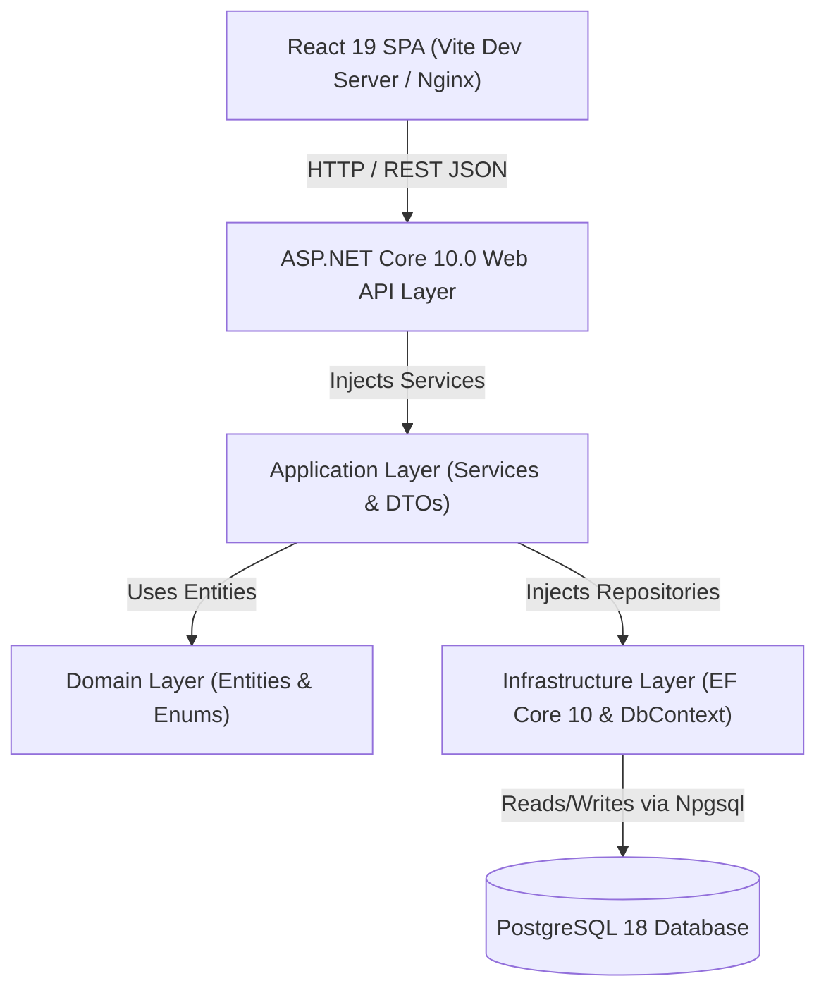
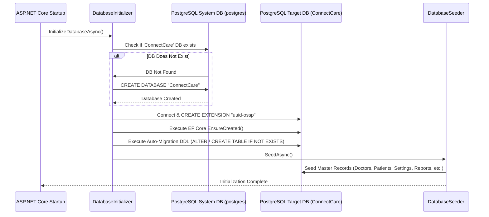
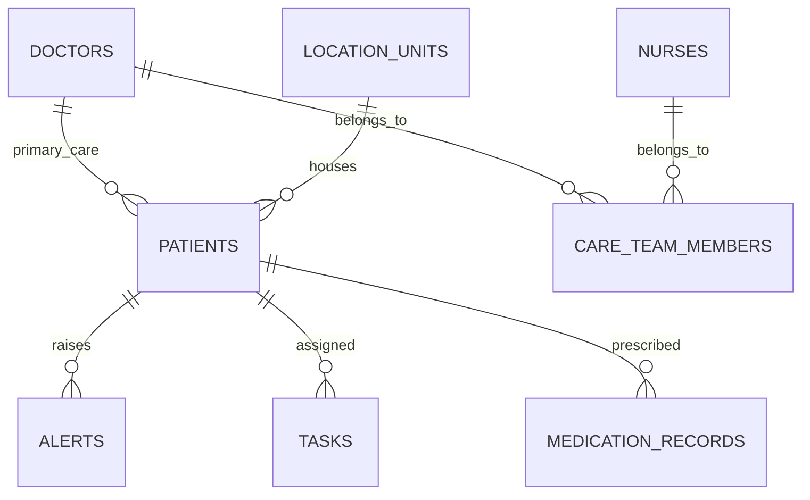

# ConnectCare - Technical Documentation & Setup Guide

> **Single Source of Truth** for ConnectCare configuration, architecture, database automation, development standards, deployment, and maintenance.

---

## Quick Start Guide

For developers setting up ConnectCare on a fresh machine with PostgreSQL and .NET 10 installed:

```bash
# 1. Clone & Navigate to Project Directory
git clone <repository-url>
cd ConnectCare

# 2. Configure Backend Connection String (backend/src/ConnectedCare.Api/appsettings.json)
# Default PostgreSQL: Host=localhost;Port=5432;Database=ConnectCare;Username=postgres;Password=root

# 3. Start Backend API (Database 'ConnectCare' will be created, migrated, and seeded automatically)
dotnet run --project backend/src/ConnectedCare.Api/ConnectedCare.Api.csproj --launch-profile http

# 4. Start React Frontend (In a separate terminal)
cd frontend
npm install
npm run dev

# 5. Access Application
# Frontend: http://localhost:5173
# API Swagger: http://localhost:5231/swagger
```

---

## 1. Project Overview

### Introduction & Purpose
**ConnectCare** is an enterprise-grade Senior Living and Assisted Care Management platform designed to streamline clinical workflows, resident monitoring, medication administration, multi-unit location management, incident reporting, custom analytics, and administrative operations.

### Key Features & Modules
1. **Resident Management**: Demographic records, admission details, primary care doctors, vital statistics monitoring, and risk level tracking.
2. **Clinical & Care Teams**: Multi-disciplinary care team assignments, doctor and nurse directory management, shift tracking, and unit allocations.
3. **Location & Unit Management**: Facility tracking across wings, floors, ICUs, occupancy rates, and bed capacity planning.
4. **Alert & Incident Operations**: Real-time vital alarms, severity categorization (Critical, High, Medium, Low), acknowledgment workflows, and incident reporting.
5. **Task & Activity Workflow**: Daily vitals checks, nursing rounds, task priority queues, assignee tracking, and completion status.
6. **Medication Administration & Safety**: Active prescription management, administration schedules, dosage logs, relative time tracking, and batch control.
7. **Custom Reports & Analytics**: Operational census summaries, clinical adherence metrics, financial transaction ledgers, and exportable custom reports.
8. **EHR Integrations & Activity Logs**: System application connections (Epic, Cerner, Omnicell), FHIR/REST sync status, and real-time activity audit logs.
9. **System Settings & Governance**: General organization preferences, user account management, role-based permission matrices, email/SMS notification templates, localization settings, security parameters, and automated database backups.

### Technology Overview
- **Frontend**: React 19 (TypeScript), Vite 8.2, Tailwind CSS v4, Lucide React icons, React Hook Form, Zod schema validation.
- **Backend**: ASP.NET Core 10.0 Web API, C# 13, Entity Framework Core 10.0.
- **Database**: PostgreSQL 18 with `uuid-ossp` extension and PL/pgSQL functions.

### Supported Environments
- **Development**: Local dev servers (`http://localhost:5173` and `http://localhost:5231`).
- **Testing**: In-memory database or dedicated test PostgreSQL database instance.
- **Staging / Production**: Self-hosted or cloud VM running Nginx reverse proxy, Systemd/Windows Service for .NET API, and managed PostgreSQL instance.

---

## 2. Complete Project Architecture

ConnectCare follows a **Clean Layered Architecture** with strict separation of concerns between presentation, API, application business logic, domain entities, infrastructure persistence, and the PostgreSQL relational database.



### Layer Responsibilities
1. **Frontend (React SPA)**: Renders feature modules, handles UI state, enforces Zod schema validation, and communicates asynchronously via Axios/Fetch API.
2. **API Layer (`ConnectedCare.Api`)**: Handles HTTP requests, enforces CORS policies, routes controller actions, executes exception handling middleware, and exposes Swagger OpenAPI specifications.
3. **Application Layer (`ConnectedCare.Application`)**: Contains domain service interfaces, DTO definitions, request validation rules, and business logic execution.
4. **Domain Layer (`ConnectedCare.Domain`)**: Defines enterprise entities, value objects, auditable base entities, and core domain enums.
5. **Infrastructure Layer (`ConnectedCare.Infrastructure`)**: Implements EF Core DbContext, Npgsql PostgreSQL database mappings, repository pattern interfaces, database auto-initialization (`DatabaseInitializer.cs`), and auto-seeding (`DatabaseSeeder.cs`).
6. **PostgreSQL Database**: Relational storage enforcing primary keys, foreign keys, unique constraints, performance indexes, PL/pgSQL triggers, and custom views.

---

## 3. Project Folder Structure

```
ConnectCare/
├── backend/
│   ├── src/
│   │   ├── ConnectedCare.Api/
│   │   │   ├── Controllers/           # REST API endpoints (Patients, Doctors, Reports, etc.)
│   │   │   ├── Middleware/            # Exception handling & request logging middleware
│   │   │   ├── appsettings.json       # Database & API configuration
│   │   │   └── Program.cs             # Application startup, DI configuration, and DB init trigger
│   │   ├── ConnectedCare.Application/ # Business logic interfaces, DTOs, and services
│   │   ├── ConnectedCare.Domain/      # AuditableEntity, Patient, Doctor, Task, Alert entities & enums
│   │   └── ConnectedCare.Infrastructure/
│   │       ├── Persistence/           # DbContext, DatabaseInitializer, DatabaseSeeder, schema.sql
│   │       └── Repositories/          # Repository implementations for data access
├── frontend/
│   ├── src/
│   │   ├── components/                # Reusable UI controls (Modal, Input, Button, Card, Badge)
│   │   ├── features/                  # Domain feature modules
│   │   │   ├── patients/              # Patient list, details, Add Patient modal
│   │   │   ├── care-teams/            # Care team directory, Add Team Member modal
│   │   │   ├── doctors/               # Doctor directory, Add Doctor modal
│   │   │   ├── nurses/                # Nurse directory, Add Nurse modal
│   │   │   ├── locations/             # Location units, Add Location modal
│   │   │   ├── alerts/                # Alert monitoring, New Alert modal
│   │   │   ├── tasks/                 # Task queue, Create Task modal
│   │   │   ├── medications/           # Medication records & dosage logs
│   │   │   ├── reports/               # Overview, Clinical, Operational, Financial, Custom Reports
│   │   │   ├── integrations/          # System integrations & Add Integration modal
│   │   │   └── settings/              # General, Users, Roles, Localization, Security, Backups
│   │   ├── lib/                       # API client configuration (api.ts)
│   │   ├── App.tsx                    # React Router route declarations & main layout shell
│   │   ├── main.tsx                   # React root entry point
│   │   └── index.css                  # Design tokens, Tailwind CSS directives, global styles
│   ├── package.json                   # Frontend dependencies & scripts
│   └── vite.config.ts                 # Vite build configuration & server dev options
└── PROJECT_DOCUMENTATION.md           # Single source of truth documentation
```

---

## 4. Technology Stack

| Category | Technology | Version | Purpose |
|---|---|---|---|
| **Frontend Framework** | React (TypeScript) | 19.0.0 | User interface rendering |
| **Build System** | Vite | 8.2.1 | Fast module bundling & HMR dev server |
| **Styling & Icons** | Vanilla CSS / Tailwind CSS | v4.0 | Responsive design system & tokens |
| **Icons** | Lucide React | 1.16.0 | Modern UI icon library |
| **Forms & Validation** | React Hook Form & Zod | 7.55.0 / 3.24.0 | Client-side modal form validation |
| **Backend Framework** | ASP.NET Core Web API | 10.0 (`net10.0`) | Cross-platform REST API server |
| **Language** | C# | 13.0 | Backend domain logic |
| **ORM / Data Access** | Entity Framework Core | 10.0.0 | Relational object-mapping |
| **PostgreSQL Provider** | Npgsql.EntityFrameworkCore.PostgreSQL | 9.0.3 | High-performance ADO.NET / EF Core provider |
| **Database** | PostgreSQL | 18.0 | Primary relational database |
| **API Documentation** | Swashbuckle.AspNetCore | 7.3.1 | Swagger UI & OpenAPI generation |

---

## 5. Prerequisites

Before setting up ConnectCare on a new machine, verify that the following tools are installed:

1. **.NET 10.0 SDK**: Required to compile and run the ASP.NET Core backend.
   - *Verification*: `dotnet --version` (Should return `10.0.x`).
2. **Node.js (v18+) & npm (v9+)**: Required to build and run the React Vite frontend.
   - *Verification*: `node -v` and `npm -v`.
3. **PostgreSQL (v14+)**: Relational database engine.
   - *Verification*: `psql --version` or check PostgreSQL service status.

---

## 6. Database Configuration

### Connection String Format
The backend API configures its PostgreSQL connection string in `backend/src/ConnectedCare.Api/appsettings.json`:

```json
{
  "ConnectionStrings": {
    "DefaultConnection": "Host=localhost;Port=5432;Database=ConnectCare;Username=postgres;Password=YOUR_POSTGRES_PASSWORD"
  }
}
```

### PostgreSQL Requirements
- **Database Name**: `ConnectCare`
- **Extensions**: `"uuid-ossp"` (Automatically enabled on startup via `DatabaseInitializer.cs`).
- **Encrypted Storage**: Sensitive credentials should be passed via environment variable `ConnectionStrings__DefaultConnection` in production environments.

---

## 7. Automatic Database Initialization

ConnectCare features a **100% automated database initialization process**. When the backend API is launched on a fresh machine:



### How It Works
1. `Program.cs` triggers `DatabaseInitializer.InitializeDatabaseAsync(...)` on application startup.
2. The initializer connects to the PostgreSQL system database (`postgres`) to check if `ConnectCare` exists.
3. If missing, it executes `CREATE DATABASE "ConnectCare";`.
4. It connects to `ConnectCare`, enables the `"uuid-ossp"` extension, and calls `context.Database.EnsureCreated()`.
5. It runs safety DDL migrations (`ALTER TABLE ADD COLUMN IF NOT EXISTS`, `CREATE TABLE IF NOT EXISTS`).
6. `DatabaseSeeder.SeedAsync()` populates rich initial data across all empty tables.

---

## 8. Environment Configuration

### Application Settings (`appsettings.json`)
```json
{
  "Logging": {
    "LogLevel": {
      "Default": "Information",
      "Microsoft.AspNetCore": "Warning"
    }
  },
  "AllowedHosts": "*",
  "ConnectionStrings": {
    "DefaultConnection": "Host=localhost;Port=5432;Database=ConnectCare;Username=postgres;Password=root"
  }
}
```

### Environment Variable Overrides (Production)
- `ConnectionStrings__DefaultConnection`: Specifies production PostgreSQL instance credentials.
- `ASPNETCORE_ENVIRONMENT`: Set to `Development`, `Staging`, or `Production`.

---

## 9. How to Run the Project (Step-by-Step)

### Step 1: Clone Repository
```bash
git clone <repository-url>
cd ConnectCare
```

### Step 2: Configure Database Credentials
Open `backend/src/ConnectedCare.Api/appsettings.json` and verify your local PostgreSQL password in `DefaultConnection`.

### Step 3: Run Backend API
```bash
dotnet run --project backend/src/ConnectedCare.Api/ConnectedCare.Api.csproj --launch-profile http
```
*Note: On first startup, the API will automatically create the PostgreSQL database `ConnectCare`, apply all schema tables, and populate seed data.*

### Step 4: Run Frontend Dev Server
Open a new terminal window:
```bash
cd frontend
npm install
npm run dev
```

### Step 5: Verify Application
- Navigate to `http://localhost:5173` in your browser.
- Verify Swagger API documentation at `http://localhost:5231/swagger`.

---

## 10. API Architecture & Endpoint Specifications

### Common Response Envelope Format
All ConnectCare API endpoints return standardized JSON payloads:

```json
{
  "success": true,
  "message": "Operation executed successfully",
  "data": { ... }
}
```

### Key API Endpoints

| Area | HTTP Method | Endpoint | Description |
|---|---|---|---|
| **Dashboard** | `GET` | `/api/dashboard/summary` | Returns aggregate KPIs and active alert metrics |
| **Patients** | `GET` | `/api/patients` | Returns list of residents with primary doctor details |
| **Patients** | `POST` | `/api/patients` | Persists a new patient record into PostgreSQL |
| **Doctors** | `GET` | `/api/doctors` | Returns doctor directory |
| **Doctors** | `POST` | `/api/doctors` | Persists a new doctor record into PostgreSQL |
| **Nurses** | `GET` | `/api/nurses` | Returns nurse directory |
| **Nurses** | `POST` | `/api/nurses` | Persists a new nurse record into PostgreSQL |
| **Care Teams** | `GET` | `/api/careteams` | Returns care team members |
| **Care Teams** | `POST` | `/api/careteams` | Persists a new care team member |
| **Locations** | `GET` | `/api/locations` | Returns location units & occupancy statistics |
| **Locations** | `POST` | `/api/locations` | Persists a new location unit |
| **Alerts** | `GET` | `/api/alerts` | Returns active alerts |
| **Alerts** | `POST` | `/api/alerts` | Persists a new alert record |
| **Tasks** | `GET` | `/api/tasks` | Returns open tasks |
| **Tasks** | `POST` | `/api/tasks` | Persists a new task record |
| **Reports** | `GET` | `/api/reports/overview` | Returns overview report metrics & activity summary logs |
| **Reports** | `GET` | `/api/reports/clinical` | Returns clinical encounters report |
| **Reports** | `GET` | `/api/reports/financial` | Returns financial transaction ledger report |
| **Reports** | `POST` | `/api/custom-reports` | Persists a custom report definition |
| **Integrations**| `GET` | `/api/integrations` | Returns integration status & activity logs |
| **Integrations**| `POST` | `/api/integrations` | Persists a new integration system record |
| **Settings** | `POST` | `/api/settings/users` | Persists a new user account item |
| **Settings** | `POST` | `/api/settings/roles` | Persists a new role definition |

---

## 11. Authentication and Authorization

- **User Accounts & Roles**: System Administrator, Administrator, Care Manager, Doctor, Nurse, Receptionist, Billing Staff, Pharmacist, Lab Technician, Viewer.
- **Permissions**: Defined dynamically per role in `role_definition_item_records`.
- **Route Protection**: Managed in React Frontend (`App.tsx`) via state-based navigation guards and user settings control.

---

## 12. Database Architecture & Relational Schema

### Database Entity ER Overview



### Core Database Tables
- `patients`: Resident records, MRN, vitals (blood pressure, heart rate, blood sugar, temp, SPO2), risk level, admission dates.
- `doctors`: Doctor profiles, specialties, departments, contact info, teleconsultation flags.
- `nurses`: Nurse directory, assigned care units, shift allocations.
- `care_team_members`: Multi-disciplinary team assignments linking doctors, nurses, and residents.
- `location_units`: Care wings, floors, room allocations, occupancy rates, and bed capacity.
- `alerts`: Safety alarms, severity levels, acknowledgment flags, patient references.
- `tasks`: Daily care tasks, due dates, assignee roles, priority levels, completion status.
- `medication_records`: Active prescriptions, administration schedules, dosage, route, batch control.
- `activity_summary_logs`: Real-time system activity logs used across reports and overview screens.
- `clinical_encounter_records`: Clinical diagnoses, outpatient/inpatient visit logs.
- `financial_transaction_records`: Billing ledgers, customer/vendor payments, insurance receipts.
- `user_account_item_records`: System user profiles, departments, avatar links, login audit timestamps.
- `role_definition_item_records`: System roles, permissions matrix JSON, user counts.
- `organization_settings_records`: Organization metadata, logo URLs, timezones, currency preferences.

---

## 13. Frontend Architecture

- **SPA Routing**: React Router (`/`, `/patients`, `/care-teams`, `/doctors`, `/nurses`, `/locations`, `/alerts`, `/tasks`, `/medications`, `/reports/*`, `/integrations`, `/settings/*`).
- **Feature Component Structure**: Each major domain lives inside `src/features/<domain>/` with dedicated `pages/` and `components/` (including Add/Create dialog modals).
- **Zod & React Hook Form**: Form inputs use typed Zod schema validators before triggering asynchronous POST API requests.
- **Auto-Refresh Callback Pattern**: When a modal successfully saves a record, it invokes `onSuccess()` to trigger an immediate background refetch of the parent page's API data.

---

## 14. Backend Architecture

- **Controllers (`ConnectedCare.Api`)**: Handles HTTP requests, calls domain repositories or EF Core DbContext, and returns standardized response wrappers.
- **Domain Entities (`ConnectedCare.Domain`)**: All entities inherit from `AuditableEntity` which provides automatic `CreatedDate`, `CreatedBy`, `UpdatedDate`, and `UpdatedBy` tracking.
- **DbContext (`ConnectedCare.Infrastructure`)**: Configures EF Core model builder conventions (`HasColumnName`, `HasMaxLength`, `Ignore(CreatedAtUtc)`).

---

## 15. Development Standards

- **SOLID & Clean Architecture**: Logic is strictly separated into API, Application, Domain, and Infrastructure projects.
- **Async / Await Pattern**: All I/O database operations execute asynchronously via `ToListAsync()`, `FirstOrDefaultAsync()`, and `SaveChangesAsync()`.
- **Snake-Case Column Mappings**: EF Core DbContext explicitly maps C# PascalCase properties to PostgreSQL lower-case snake_case column names (`doctor_id_code`, `is_acknowledged`, `updated_date`).

---

## 16. Testing Strategy

- **Automated API Integration Tests**: Included PowerShell test runner (`scratch/test_all_modals.ps1`) testing all 10 creation APIs against PostgreSQL.
- **Frontend Build Validation**: Tested via `npm run build` (`tsc -b && vite build`) ensuring zero TypeScript compilation errors.
- **Backend Build Validation**: Tested via `dotnet build` ensuring 0 warnings and 0 compilation errors.

---

## 17. Troubleshooting Guide

### 1. Connection Refused to PostgreSQL
- *Symptom*: `Npgsql.PostgresException: Connection refused` or `database "ConnectCare" does not exist`.
- *Solution*: Verify PostgreSQL service is running (`pg_ctl status` or Windows Service Manager). Ensure `appsettings.json` host/port parameters match your local PostgreSQL server configuration.

### 2. Relation / Table Does Not Exist
- *Symptom*: `Npgsql.PostgresException: relation "xyz" does not exist`.
- *Solution*: Restart the backend API (`dotnet run`). `DatabaseInitializer` automatically checks and runs missing DDL migrations on startup.

### 3. CORS Error on Frontend
- *Symptom*: Access to `http://localhost:5231/api/...` blocked by CORS policy.
- *Solution*: Ensure backend `Program.cs` includes `AllowReactApp` CORS policy allowing `http://localhost:5173`.

---

## 18. Deployment Guide

### Production Build Steps
1. **Build Backend Production Release**:
   ```bash
   dotnet publish backend/src/ConnectedCare.Api/ConnectedCare.Api.csproj -c Release -o ./publish
   ```
2. **Build Frontend Static Assets**:
   ```bash
   cd frontend
   npm run build
   ```
3. **Deploy Web Server (Nginx)**:
   - Configure Nginx to serve `frontend/dist/` as static assets.
   - Configure reverse proxy location `/api/` pointing to `.NET API` running on `http://localhost:5231`.

---

## 19. Security Best Practices

- **Parametrized Queries**: EF Core executes parametrized SQL queries via Npgsql, preventing SQL injection vulnerabilities.
- **Zod Input Validation**: Sanitizes form inputs client-side prior to API submission.
- **Audit Field Enforcement**: Every auditable database entity automatically captures creation and modification timestamps in UTC.

---

## 20. Maintenance and Operations

### Adding a New Screen or Feature Module
1. Define Entity class in `ConnectedCare.Domain/Entities/Entities.cs`.
2. Add `DbSet<NewEntity>` in `ConnectedCareDbContext.cs` with column mappings in `OnModelCreating`.
3. Add migration script in `DatabaseInitializer.cs` (`CREATE TABLE IF NOT EXISTS...`).
4. Implement API Controller in `ConnectedCare.Api/Controllers/`.
5. Create React Feature directory in `frontend/src/features/new-feature/` with page and modal components.
6. Register Route in `frontend/src/App.tsx`.

---

## 21. Summary

The ConnectCare application is fully documented, verified, and equipped with automated database creation and seeding. New developers can clone the repository, run `dotnet run` on the API, and immediately have a fully functional healthcare management environment running locally.
